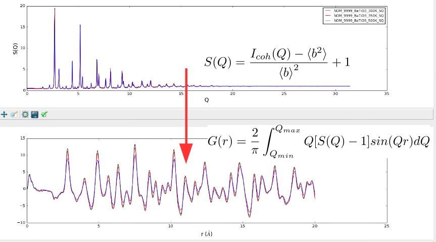

=====
About
=====
From total scattering functions, we have reciprocal-space structure factors and real-space pair distribution functions that are related via a Fourier transform.
PyStoG is a package that allows for:

1. Converting between the various functions used by different "communities" (ie researchers who study crystalline versus amorphous or glass materials).
   Conversions are for either real-space or reciprocal-space.
2. Perform the transform between the different available functions of choice
3. Fourier filter to remove spurious artificats in the data (ie aphysical, sub-angstrom low-r peaks in G(r) from experiments)

The name **PyStoG** comes from the fact that this is a *Pythonized* version of **StoG**, a ~30 year old Fortran program that is part of the RMCProfile_ software suite.
**StoG** means **"S(Q) to G(r)"** for the fact that it takes recirpocal-space S(Q) patterns from files and transforms them into a single G(r) pattern.
The original *StoG* program has been developed, in reverse chronological order, by:

 * Matthew Tucker and Martin Dove (~2009)
 * Spencer Howells (~1989)
 * Jack Carpenter (prior to 1989)

 A current state of the **StoG** program is kept in the `fortran` directory of this package.

This project was initially just a "sandbox" for taking the capabilities of **StoG** and migrating them over to the Mantid_ Framework.
With more and more use cases, **PyStoG** was further developed as the stand-alone project it is now.
Yet, migration to the Mantid Framework is still a goal since it feeds into the ADDIE_ project.

PyStoG is not a Python replica of StoG but has the same goal as StoG.
Yet, has capabilites that surpass StoG such as multiple input/output real
and reciprocal space functions and modules allowing for re-construction of the workflow for processing total scattering data.

.. _RMCProfile: http://www.rmcprofile.org/Main_Page
.. _Mantid: https://github.com/mantidproject/mantid
.. _ADDIE: https://github.com/neutrons/addie
